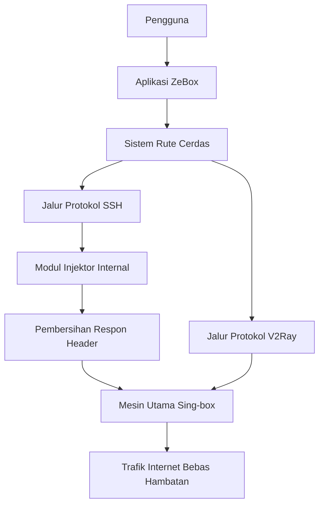

  
  
  <h1>ZeBox Master Edition</h1>
  <em>Klien Proksi VPN dan Injektor Canggih Generasi Berikutnya</em>
    
  
  
  
  

    
  <a href="#ikhtisar-proyek">Ikhtisar</a> • <a href="#diagram-alur-kerja-sistem">Alur Kerja</a> • <a href="#arsitektur-dan-fitur-utama">Fitur Utama</a> • <a href="#panduan-mengunduh-apk">Panduan APK</a> • <a href="#kompilasi-mandiri">Kompilasi</a>

## Ikhtisar Proyek

ZeBox adalah modifikasi klien proksi mutakhir yang dirancang secara khusus untuk memecahkan berbagai keterbatasan konfigurasi jaringan konvensional. Diciptakan bagi para pengguna tingkat lanjut, ZeBox mengintegrasikan kekuatan protokol proksi modern beserta keandalan klasik Secure Shell ke dalam satu infrastruktur aplikasi yang sangat ringan.

Melalui pendekatan rekayasa tingkat rendah, aplikasi ini memangkas konsumsi memori dan daya baterai secara drastis sembari mempertahankan performa transmisi data yang agresif. Anda dapat berselancar, melakukan penyiaran video, dan menjalankan permainan daring tanpa hambatan penyedia layanan internet.

Versi ini dibangun secara eksklusif untuk memberikan keseimbangan absolut antara efisiensi sumber daya sistem dan keandalan koneksi proksi kelas atas.

---

## Diagram Alur Kerja Sistem

Bagan berikut memvisualisasikan bagaimana arus jaringan Anda diamankan dan diteruskan melalui mesin ZeBox secara terstruktur.

---

## Arsitektur dan Fitur Utama

ZeBox merombak cara aplikasi VPN beroperasi dari akarnya. Berikut adalah penjelasan langkah demi langkah mengenai mekanisme setiap fitur utama dari ZeBox Master Edition:

### 1. Dual Workspace Interface
Langkah kerja:
- Sistem membagi memori layar menjadi dua ruang kerja terpisah secara fisik.
- Ruang pertama dikhususkan untuk menampung seluruh profil V2Ray.
- Ruang kedua dikhususkan untuk menampung seluruh profil SSH.
- Saat pengguna menggeser layar, mesin antarmuka hanya akan memuat profil yang sesuai dengan ruang kerja aktif.
- Metode pembagian ini mencegah penumpukan sampah memori dan menjaga kestabilan perangkat secara drastis.

### 2. Native SSH HTTP Custom Injector
Langkah kerja:
- Pengguna memulai koneksi menuju peladen SSH.
- Modul internal mencegat trafik tersebut sebelum keluar ke jaringan publik.
- Modul akan menyuntikkan muatan teks kustom ke dalam lalu lintas data.
- Sistem akan menyaring balasan dari peladen dan menelan respon teks yang tidak sesuai dengan standar SSH.
- Arus data bersih kemudian diteruskan ke mesin utama untuk dienkripsi dengan sempurna.

### 3. Smart Import
Langkah kerja:
- Mesin pemindai memantau papan klip perangkat secara pasif.
- Saat mendeteksi teks kredensial proksi, sistem secara pintar mengekstrak data penting seperti nama host dan kata sandi.
- Sistem lalu merangkai data tersebut menjadi satu profil peladen yang utuh.
- Profil langsung disimpan ke dalam pangkalan data tanpa menuntut pengisian manual dari pengguna.

### 4. Advanced Anti-DPI
Langkah kerja:
- Sistem mencegat paket perkenalan awal dari klien menuju peladen internet.
- Paket data tersebut dipecah secara halus menjadi beberapa kepingan kecil.
- Kepingan kecil ini dikirimkan ke menara seluler secara bergiliran.
- Mesin pelacak penyedia layanan internet gagal merangkai ulang kepingan tersebut.
- Pengguna berhasil menembus pemblokiran sistem jaringan secara mutlak.

### 5. Stabilisator Otomatis
Langkah kerja:
- Layar perangkat ditutup dan sistem operasi mencoba menidurkan semua aplikasi untuk menghemat baterai.
- Modul latar belakang ZeBox segera mengambil alih kendali manajemen daya perangkat.
- Sistem memaksa prosesor sentral untuk terus terjaga secara parsial.
- Lalu lintas data tetap mengalir lancar tanpa pemutusan sepihak dari sistem operasi.

---

## Panduan Mengunduh APK

ZeBox didistribusikan dalam berbagai versi arsitektur demi memastikan performa terbaik di setiap tipe ponsel. Agar tidak bingung saat memilih di halaman rilis, perhatikan panduan berikut:

1. **arm64-v8a**
   Sangat direkomendasikan untuk ponsel cerdas modern keluaran terbaru. Ini adalah opsi yang paling aman, paling ringan, dan kinerjanya paling optimal.

2. **armeabi-v7a**
   Dikhususkan untuk perangkat ponsel cerdas generasi lawas kelas bawah. Gunakan opsi ini jika instalasi varian sebelumnya mengalami kegagalan.

3. **x86 atau x86_64**
   Didesain khusus untuk penggunaan pada emulator Android di komputer atau laptop.

4. **universal**
   Pilihan paling aman yang mencakup seluruh arsitektur mesin sekaligus. Opsi ini ditujukan bagi pengguna yang tidak mengetahui spesifikasi perangkat keras ponselnya.

---

## Kompilasi Mandiri

Bagi pengembang yang berminat untuk menyusun aplikasi ini secara mandiri, proses telah terotomatisasi di awan. Berikut adalah panduannya:

- Lakukan penyalinan repositori ini ke akun GitHub pribadi Anda.
- Buka menu Actions pada bilah navigasi utama repositori.
- Pilih skema alur kerja Release Build di panel sebelah kiri.
- Jalankan skema tersebut dan tentukan nama versi rilis yang Anda inginkan.
- Sistem akan segera mengompilasi paket instalasi untuk seluruh arsitektur prosesor.
- Unduh berkas instalasi dari halaman rilis setelah seluruh rangkaian proses kompilasi tuntas.

---

  Dibangun dengan ketelitian teknis, dedikasi, dan semangat sumber terbuka.

